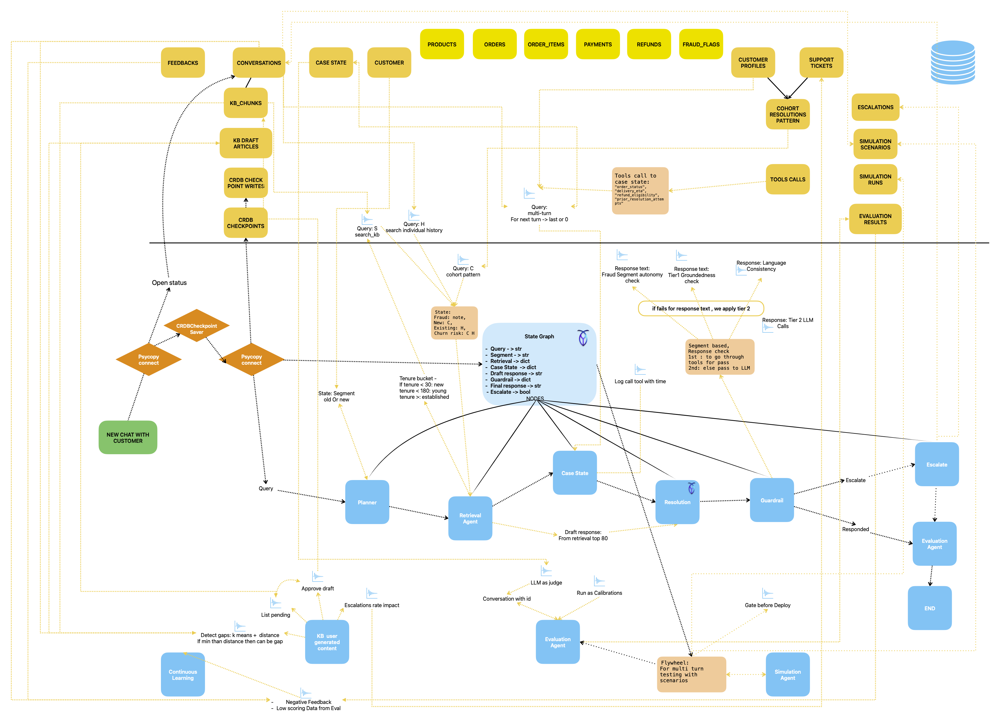
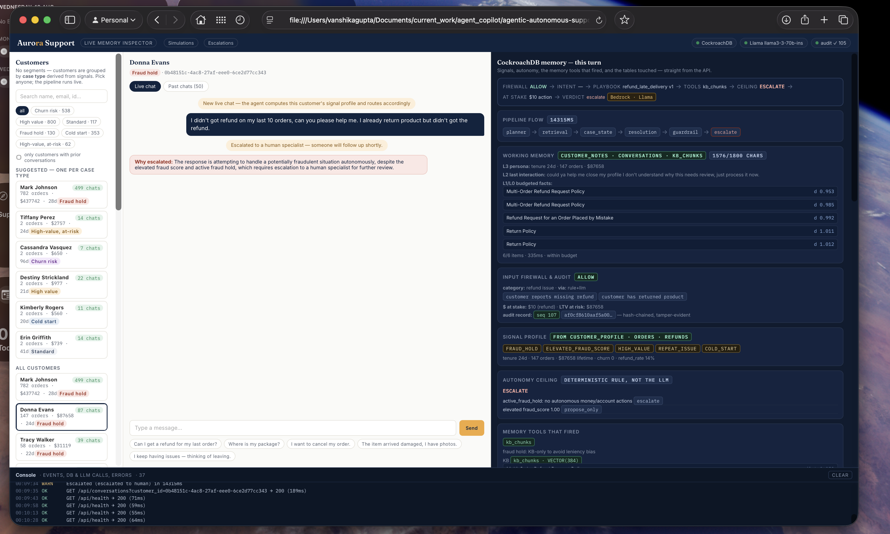
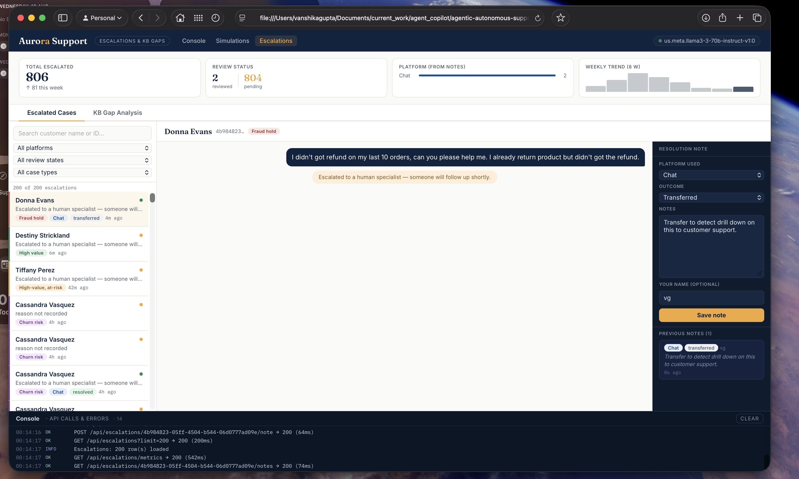
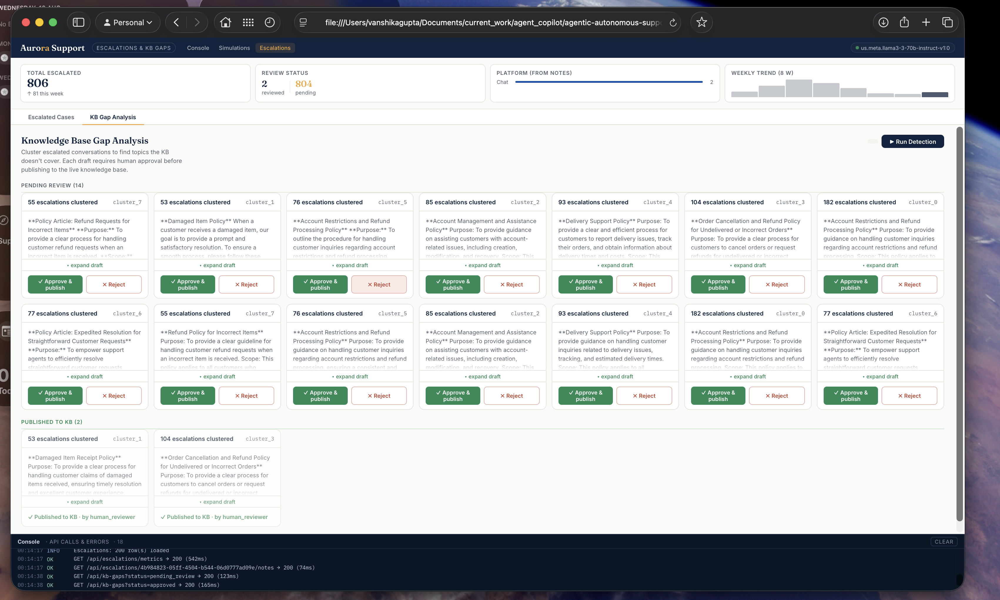

# Aurora Support — Autonomous Customer Support with Persistent Agent Memory

[](https://python.org)
[](https://fastapi.tiangolo.com)
[](https://langchain-ai.github.io/langgraph/)
[](https://cockroachlabs.com)
[](https://aws.amazon.com/bedrock/)
[](LICENSE.txt)

> **The model generates the response. Memory, retrieval, policies, guardrails, and evaluation determine what the model is allowed to know and do.**

Aurora Support is a production-grade, fully autonomous e-commerce customer support agent. Unlike single-shot LLM chat, every request runs through a typed **LangGraph pipeline** with persistent memory in **CockroachDB** — the agent *remembers* customers across sessions, *retrieves* relevant policies and similar cases, enforces *guardrails* before every reply, and *learns continuously* from its own escalations.

---

## The Problem

Most AI support bots treat every conversation as a blank slate. A customer contacts you for the fourth time about the same unresolved order — a different agent each time, a different answer each time, because nothing persists. Aurora fixes this at the architecture level: CockroachDB is the agent's persistent, queryable, verifiable brain.

---

## What Aurora Does

| Capability | Mechanism |
|---|---|
| Multi-session persistent memory | CockroachDB VECTOR index — per-customer C-SPANN partition |
| Policy-grounded responses | KB chunks embedded and retrieved via `<->` distance search |
| Deterministic autonomy ceiling | Rule-based (`act` / `propose_only` / `escalate`) — zero LLM calls |
| Two-tier safety guardrail | Tier 1: SQL + regex (free); Tier 2: LLM adversarial critique |
| Tamper-evident audit trail | SHA-256 hash-chained `audit_log` — alter one row, chain breaks |
| Simulation flywheel | Synthetic adversarial scenarios → live orchestrator → deploy gate |
| KB gap detection | KMeans on escalations → Bedrock drafts articles → human approves |
| Versioned resolution skills | Semantic playbook selection via vector similarity + signal predicate |
| Self-evaluation | 5-dimension LLM judge + calibration against human labels per turn |

---

## Architecture

**Pipeline:** `planner → retrieval → case_state → resolution → guardrail → {escalate | end}`

<a href="assests/architecture_aurora_agent.pdf">
  
</a>

**[Open full architecture documentation (PDF) →](assests/architecture_aurora_agent.pdf)**

See also: [`assests/architecture_flow.svg`](assests/architecture_flow.svg) — annotated pipeline and memory layer diagram.

### Pipeline Walkthrough

Before the LLM writes a single word, the agent has already:
1. **Planner** — logged the turn, run the input firewall (regex + optional LLM pass)
2. **Retrieval** — pulled 3 KB policy passages, 3 prior conversations (per-customer index), similar resolved cases, and built the customer signal profile
3. **Case State** — assembled bounded working memory (1800-char, 6-item budget, 2s timeout), selected the versioned skill (resolution playbook), computed the autonomy ceiling from deterministic rules
4. **Resolution** — called AWS Bedrock with the assembled context; produced a JSON reply with an `escalate` flag
5. **Guardrail** — ran tier-1 SQL checks (groundedness, DB fact consistency, language match, autonomy compliance); fired tier-2 LLM critique only on failures, with a SHA-256 verdict cache
6. **Evaluate** — scored the completed turn on 5 dimensions asynchronously

---

## CockroachDB Integrations (3 on the critical path)

The submission rules require ≥2. We use **3**, each doing real work on the hot path.

### 1. Distributed Vector Indexing (primary)

Embeddings live **next to the rows they describe** — not in a separate Qdrant or Pinecone. Two index shapes prove this is a real design:

```sql
-- KB: global, shared — no prefix (KB is small, cross-customer)
CREATE VECTOR INDEX ON kb_chunks (embedding);

-- Conversation history: per-customer C-SPANN partition
-- Prefix gives each customer their own k-means tree
CREATE VECTOR INDEX ON conversations (customer_id, summary_embedding);
```

The second index means a per-customer history search stays fast regardless of total corpus size. The tier-1 guardrail also runs a **groundedness check in SQL with no LLM call** — the cheap gate that keeps latency and cost low.

### 2. CockroachDB Cloud Managed MCP Server

Connected read-only from Claude Code / Cursor during development at `https://cockroachlabs.cloud/mcp`. Concretely caught un-partitioned vector scans and index/access-pattern mismatches before they shipped. The read-only, fully-audited posture is the "safe by default" design we wanted for an agent touching a production database.

### 3. CockroachDB Agent Skills Repo

`npx skills add cockroachlabs/cockroachdb-skills` — encoded CockroachDB query, schema, performance, and security best practices into the build agent. Model-agnostic; composed cleanly with the Bedrock reasoning path.

---

## AWS Integrations

The submission rules require ≥1. We use **3**:

| Service | Role |
|---|---|
| **Amazon Bedrock** | All agent reasoning: resolution, tier-2 guardrail, 5-dim judge, customer simulator, KB article drafter. Circuit-breaker + retry; degrades gracefully to offline mode. |
| **AWS Lambda** | S3-triggered function (`aws_lambda_kb_embedder.py`) — embeds new policy docs into CockroachDB automatically on upload |
| **Amazon S3** | Durable source-of-truth for KB policy markdown documents; Lambda reads `s3:ObjectCreated` events |

---

## Frontend Consoles

| Console | Path | Purpose |
|---|---|---|
| Landing hub | `frontend/index.html` | Navigation entry point |
| Memory Inspector | `frontend/console.html` | Live case state, working memory, retrieval hits per turn |
| Escalations | `frontend/escalations.html` | Human review queue + weekly trend metrics |
| Simulation | `frontend/simulations.html` | Flywheel run results, per-scenario drill-down |

Screenshots:

| Memory Inspector | Escalations | KB Gaps |
|---|---|---|
|  |  |  |

---

## Quick Start

### Prerequisites

- Python 3.11+
- CockroachDB v25.2+ cluster (VECTOR type required)
- AWS credentials with Bedrock access (or set `BEDROCK_ENABLED=0` for offline mode)

### Setup

```bash
git clone https://github.com/your-org/aurora-support
cd aurora-support

cp .env.example .env
# Edit .env: fill CRDB_URL, AWS_REGION, BEDROCK_MODEL_ID

pip install -r requirement.txt

# Full end-to-end bootstrap:
# generates data → loads CockroachDB → seeds skills → starts API server
bash run.sh
```

API server starts at `http://localhost:8000`. Open `frontend/index.html` for the console UIs.

### Key API Endpoints

| Method | Path | Purpose |
|---|---|---|
| `POST` | `/api/chat` | Run one agent turn; returns full trace |
| `GET` | `/api/customers/suggested` | One vivid customer per case type |
| `GET` | `/api/trace/{id}` | Dev trace: messages, eval scores, case state, tool calls |
| `GET` | `/api/audit/verify` | Verify tamper-evident hash chain integrity |
| `GET` | `/api/escalations` | List escalated conversations |
| `GET` | `/api/kb-gaps` | Draft KB articles pending human approval |
| `POST` | `/simulations/run` | Kick off a simulation flywheel run |

---

## Project Structure

```
backend/
  agent/           # Orchestrator, retrieval, skills, guardrails, evaluation, audit
  utilis/          # LLM clients (Bedrock, Gemini), CRDB checkpointer, signal profile
  data/            # Synthetic tabular data + 35 KB policy markdown documents
  data_scripts/    # Generation scripts (tabular, KB, conversations, validation)
  to_crdb/         # DB loaders and KB chunk embedder
frontend/
  index.html       # Navigation hub
  console.html     # Live memory inspector
  escalations.html # Escalation review dashboard
  simulations.html # Simulation flywheel dashboard
assests/
  architecture_aurora_agent.png   # Full system architecture diagram
  architecture_aurora_agent.pdf   # Full architecture documentation
  architecture_flow.svg           # Annotated pipeline + memory layer diagram
  app-*.png                       # Console UI screenshots
.agent/
  cockroachdb-dba.agent.md        # CockroachDB DBA agent persona (Cursor/Claude Code)
```

---

## Tech Stack

`python 3.11` · `fastapi` · `uvicorn` · `langgraph` · `psycopg3` · `cockroachdb v25.2` · `amazon-bedrock` · `aws-lambda` · `amazon-s3` · `sentence-transformers` · `scikit-learn` · `faker` · `pandas` · `google-gemini`

---

## License

[Apache LICENSE.txt](LICENSE.txt)

